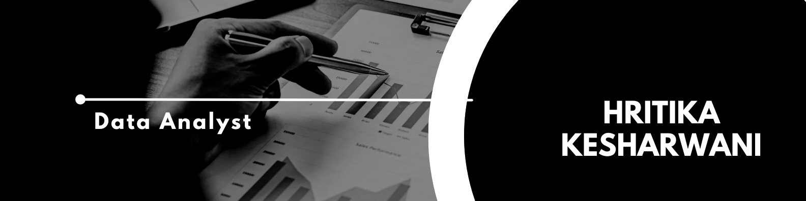

# 👋 Hi there, I'm Hritika Kesharwani

I'm a data analyst with 2 years of experience in data analysis and visualization. My goal is to uncover insights and trends from data to drive decision-making and business success.

## 🛠 Skills

- **Python**: Data manipulation, analysis, and visualization using libraries like pandas, NumPy, Matplotlib, and Seaborn.
- **SQL**: Writing complex queries, managing databases, and performing data extraction and transformation.
- **Excel**: Advanced functions, pivot tables, data analysis, and visualization.
- **Power BI**: Creating interactive dashboards and reports to visualize data and derive insights.

## 🌟 Projects

### 1. YouTube Text Data Analysis
- **Description**: This project involves analyzing textual data from YouTube video comments to gain insights into viewer sentiments, popular topics, and trends. By leveraging Python and its powerful data analysis libraries, the project aims to uncover patterns and extract meaningful information from large volumes of comment data.
- **Tools Used**: Python, pandas, Matplotlib
- **Repository**: [[GitHub Link](https://github.com/hritika9/Youtube-text-data-analysis.git)](#)

### 2. Employee Attrition Dashboard
- **Description**: This project involves creating a comprehensive dashboard in Power BI to analyze employee attrition. The dashboard aims to provide insights into employee turnover, identify key factors contributing to attrition, and help organizations take proactive measures to improve employee retention.
- **Tools Used**: Power BI
- **Repository**: [[GitHub Link](https://github.com/hritika9/Hr-Analytics-Dashboard.git)](#)

## 📈 Experience

- **Tata Consultancy Servies** (Sept 2022 - Present)
  - Analyzed large datasets to extract actionable insights.
  - Developed automated reports and dashboards using Power BI.
  - Collaborated with cross-functional teams to understand business needs and deliver data-driven solutions.
  - Managed databases and performed complex SQL queries.
  - Conducted data cleaning and preprocessing using Python and Excel.
  - Created visualizations and reports to present findings to stakeholders.

## 📫 Contact

- **Email**: Hritikakesharwani1999@gmail.com
- **LinkedIn**: https://www.linkedin.com/in/hritikakesharwani/
- **GitHub**: [[GitHub Profile]](https://github.com/hritika9)

Feel free to reach out if you have any questions or if you'd like to collaborate on a project!

---

Thank you for visiting my profile. I look forward to connecting with you!
